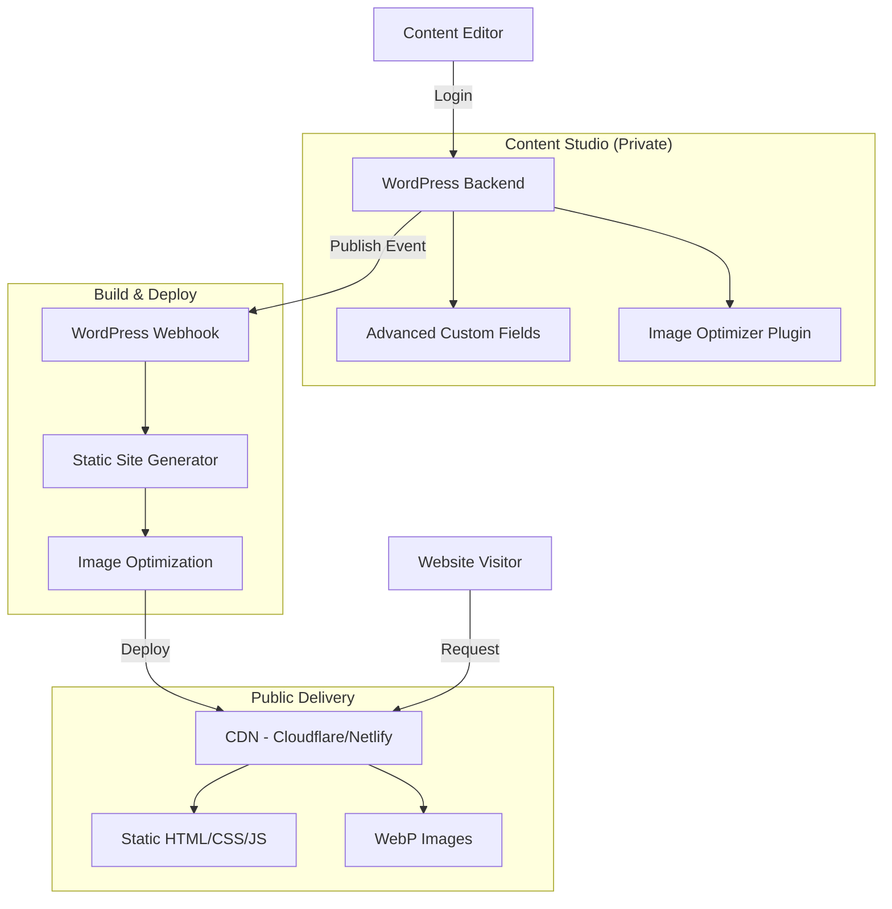

# Design Document

## Overview

The Fikzstudio agency website follows a **headless WordPress + static frontend architecture** to achieve maximum performance, security, and editorial simplicity. WordPress serves as a private content studio accessible only to authenticated users, while the public site is generated as static files and served via CDN. This separation ensures sub-2.5s load times, excellent SEO, and a streamlined content management experience.

The system consists of three primary layers:
1. **Content Studio (WordPress)** - Private backend for content authoring
2. **Static Site Generator** - Build process that transforms WordPress content into static files
3. **CDN Delivery** - Global content delivery network serving optimized static assets

## Architecture

### High-Level Architecture



### Technology Stack

**Content Studio:**
- WordPress 6.4+ (PHP 8.1+)
- Advanced Custom Fields Pro (for Portfolio custom fields)
- ShortPixel or Imagify (WebP conversion + compression)
- Code Snippets Pro or custom MU-plugin (for safe code injection)
- WP REST API (for headless content delivery)

**Static Site Generator (Recommended):**
- **Option A**: Next.js 14+ with Static Site Generation (SSG) + Incremental Static Regeneration (ISR)
- **Option B**: Astro 4+ with WordPress integration
- **Option C**: WP2Static plugin (pure WordPress export)

**Frontend Framework:**
- React 18+ (if using Next.js)
- TypeScript for type safety
- Tailwind CSS for styling
- Framer Motion for animations (optional)

**Image Optimization:**
- Sharp (Node.js) or WordPress plugins for server-side processing
- WebP + AVIF format support
- Responsive image generation (srcset)

**Deployment & Hosting:**
- Cloudflare Pages, Netlify, or Vercel for CDN + hosting
- GitHub Actions or platform-native CI/CD
- Separate domains: `fikzstudio.com` (public) and `studio.fikzstudio.com` (WordPress)

**Monitoring & Analytics:**
- Google Analytics 4
- Cloudflare Web Analytics (privacy-friendly)
- Sentry or LogRocket for error tracking
- Lighthouse CI for automated performance testing

### Data Flow

1. **Content Creation Flow:**
   - Editor logs into WordPress Content Studio
   - Creates/edits Blog Post or Portfolio Project
   - Uploads images (auto-optimized to WebP)
   - Clicks "Publish"
   - WordPress triggers webhook to build system
   - Static site generator fetches content via WP REST API
   - Generates static HTML pages
   - Deploys to CDN
   - CDN serves updated content globally

2. **Visitor Request Flow:**
   - Visitor requests page (e.g., `/portfolio/project-name`)
   - CDN serves cached static HTML
   - Browser loads optimized CSS/JS
   - Images lazy-load as WebP with srcset
   - Analytics tracks page view
   - No database queries or server processing

## Components and Interfaces

### 1. WordPress Content Studio

**Purpose:** Private backend for content management restricted to Blog and Portfolio.

**Key Components:**

**1.1 Custom Post Type: Portfolio**
```php
// Portfolio CPT registration
register_post_type('portfolio', [
    'labels' => [...],
    'public' => true,
    'show_in_rest' => true, // Enable REST API
    'supports' => ['title', 'editor', 'thumbnail'],
    'has_archive' => true,
    'rewrite' => ['slug' => 'work']
]);
```

**1.2 ACF Field Groups**

Portfolio Project Fields:
- `short_summary` (Textarea)
- `cover_image` (Image)
- `gallery` (Gallery)
- `services_provided` (Checkbox: Web Design, SEO, Maintenance, Branding, etc.)
- `tech_stack` (Repeater: Technology name)
- `industry` (Text)
- `results` (Repeater: Result description)
- `external_link` (URL)
- `testimonial` (Group: quote, author, role, company)
- `seo_meta_title` (Text)
- `seo_meta_description` (Textarea)
- `seo_og_image` (Image)

Blog Post Fields (via Yoast SEO or custom):
- `seo_meta_title` (Text)
- `seo_meta_description` (Textarea)
- `seo_og_image` (Image)

**1.3 Role & Capability Management**

```php
// Restrict Editor role to Posts, Portfolio, Media only
function fikz_restrict_editor_menus() {
    if (current_user_can('editor')) {
        remove_menu_page('themes.php');      // Appearance
        remove_menu_page('plugins.php');     // Plugins
        remove_menu_page('tools.php');       // Tools
        remove_menu_page('options-general.php'); // Settings
        remove_menu_page('edit-comments.php'); // Comments
    }
}
add_action('admin_menu', 'fikz_restrict_editor_menus', 999);
```

**1.4 Image Optimization Pipeline**

```php
// Hook into upload process
add_filter('wp_handle_upload', 'fikz_optimize_on_upload');

function fikz_optimize_on_upload($upload) {
    // 1. Compress image (via ShortPixel API or local)
    // 2. Generate WebP version
    // 3. Create responsive sizes (320w, 640w, 1024w, 1920w)
    // 4. Enforce max dimension (2000px)
    return $upload;
}
```

**1.5 Code Snippets Management**

Use Code Snippets Pro plugin with restrictions:
- Only Admin role can create/edit snippets
- Snippets are versioned in database
- Error handling prevents fatal errors
- Snippets can be scoped to frontend, admin, or both

**1.6 REST API Endpoints**

WordPress exposes:
- `/wp-json/wp/v2/posts` - Blog posts
- `/wp-json/wp/v2/portfolio` - Portfolio projects
- `/wp-json/wp/v2/media` - Media library
- `/wp-json/wp/v2/categories` - Categories
- `/wp-json/wp/v2/tags` - Tags

Custom endpoint for full site data:
```php
register_rest_route('fikz/v1', '/site-data', [
    'methods' => 'GET',
    'callback' => 'fikz_get_site_data',
    'permission_callback' => '__return_true'
]);
```

### 2. Static Site Generator (Next.js Approach)

**Purpose:** Transform WordPress content into optimized static pages.

**Key Components:**

**2.1 Data Fetching Layer**

```typescript
// lib/wordpress.ts
export async function getAllPosts() {
    const res = await fetch(`${WP_API_URL}/wp/v2/posts?_embed&per_page=100`);
    return res.json();
}

export async function getPostBySlug(slug: string) {
    const posts = await fetch(`${WP_API_URL}/wp/v2/posts?slug=${slug}&_embed`);
    return posts.json()[0];
}

export async function getAllPortfolioProjects() {
    const res = await fetch(`${WP_API_URL}/wp/v2/portfolio?_embed&per_page=100`);
    return res.json();
}
```

**2.2 Page Templates**

```typescript
// pages/work/[slug].tsx - Portfolio Detail Template
export async function getStaticPaths() {
    const projects = await getAllPortfolioProjects();
    return {
        paths: projects.map(p => ({ params: { slug: p.slug } })),
        fallback: 'blocking' // ISR support
    };
}

export async function getStaticProps({ params }) {
    const project = await getPortfolioBySlug(params.slug);
    return {
        props: { project },
        revalidate: 60 // Revalidate every 60 seconds
    };
}
```

**2.3 Image Component**

```typescript
// components/OptimizedImage.tsx
import Image from 'next/image';

export function OptimizedImage({ src, alt, ...props }) {
    // Convert WordPress image URL to WebP
    const webpSrc = src.replace(/\.(jpg|jpeg|png)$/, '.webp');
    
    return (
        <Image
            src={webpSrc}
            alt={alt}
            loading="lazy"
            quality={85}
            {...props}
        />
    );
}
```

**2.4 SEO Component**

```typescript
// components/SEO.tsx
import Head from 'next/head';

export function SEO({ title, description, ogImage, canonical }) {
    return (
        <Head>
            <title>{title} | Fikzstudio</title>
            <meta name="description" content={description} />
            <meta property="og:title" content={title} />
            <meta property="og:description" content={description} />
            <meta property="og:image" content={ogImage} />
            <link rel="canonical" href={canonical} />
            <script type="application/ld+json">
                {JSON.stringify(generateSchema())}
            </script>
        </Head>
    );
}
```

### 3. Deploy Pipeline

**Purpose:** Automate build and deployment on content publish.

**Key Components:**

**3.1 WordPress Webhook Trigger**

```php
// Trigger build on publish
add_action('publish_post', 'fikz_trigger_deploy');
add_action('publish_portfolio', 'fikz_trigger_deploy');

function fikz_trigger_deploy($post_id) {
    $webhook_url = get_option('fikz_deploy_webhook');
    wp_remote_post($webhook_url, [
        'body' => json_encode(['post_id' => $post_id]),
        'headers' => ['Content-Type' => 'application/json']
    ]);
}
```

**3.2 CI/CD Pipeline (GitHub Actions Example)**

```yaml
# .github/workflows/deploy.yml
name: Deploy to Production

on:
  repository_dispatch:
    types: [wordpress-publish]
  workflow_dispatch:

jobs:
  build-and-deploy:
    runs-on: ubuntu-latest
    steps:
      - uses: actions/checkout@v3
      - uses: actions/setup-node@v3
      - run: npm ci
      - run: npm run build
      - run: npm run export
      - name: Deploy to Cloudflare Pages
        uses: cloudflare/pages-action@v1
        with:
          apiToken: ${{ secrets.CF_API_TOKEN }}
          accountId: ${{ secrets.CF_ACCOUNT_ID }}
          projectName: fikzstudio
          directory: out
```

**3.3 Rollback Mechanism**

- Each deploy creates a versioned artifact
- Cloudflare Pages maintains deployment history
- Rollback via dashboard or API call
- Preview deployments for testing before production

### 4. Frontend Components

**Purpose:** Reusable UI components for consistent design.

**Key Components:**

**4.1 Hero Section**
- Large heading with gradient text
- Subheading with value proposition
- Primary CTA (WhatsApp) + Secondary CTA (View Work)
- Background with subtle animation

**4.2 Service Cards**
- Icon + Title + Description
- Hover effect with elevation
- CTA link to contact

**4.3 Portfolio Grid**
- Masonry or grid layout
- Cover image + Title + Services tags
- Filter by service type (optional)
- Lazy-load images

**4.4 Case Study Template**
- Hero image
- Problem statement
- Solution approach
- Results (metrics/bullets)
- Testimonial (if available)
- Gallery
- CTA to next project

**4.5 Blog List**
- Featured image + Title + Excerpt
- Category tags
- Read time estimate
- Pagination or infinite scroll

**4.6 Blog Post Template**
- Featured image
- Title + Author + Date
- Rich content with proper typography
- Related posts section
- Share buttons
- CTA to contact

**4.7 Contact Form**
- Name, Email, Phone, Message fields
- Client-side validation
- Server-side submission (API route)
- Success/error states
- WhatsApp alternative CTA

**4.8 Footer**
- Company info
- Quick links
- Social media icons
- Copyright + Privacy/Terms links

## Data Models

### Blog Post

```typescript
interface BlogPost {
    id: number;
    slug: string;
    title: string;
    excerpt: string;
    content: string; // HTML
    featuredImage: {
        url: string;
        alt: string;
        width: number;
        height: number;
    };
    categories: Category[];
    tags: Tag[];
    author: {
        name: string;
        avatar?: string;
    };
    publishedAt: string; // ISO 8601
    seo: {
        metaTitle: string;
        metaDescription: string;
        ogImage: string;
    };
    status: 'draft' | 'published';
}
```

### Portfolio Project

```typescript
interface PortfolioProject {
    id: number;
    slug: string;
    title: string;
    shortSummary: string;
    coverImage: {
        url: string;
        alt: string;
        width: number;
        height: number;
    };
    gallery: Image[];
    servicesProvided: string[]; // ['Web Design', 'SEO', 'Maintenance']
    techStack: string[]; // ['Next.js', 'WordPress', 'Tailwind']
    industry: string;
    results: string[]; // Bullet points
    externalLink?: string;
    testimonial?: {
        quote: string;
        author: string;
        role: string;
        company: string;
    };
    seo: {
        metaTitle: string;
        metaDescription: string;
        ogImage: string;
    };
    status: 'draft' | 'published';
}
```

### Category / Tag

```typescript
interface Category {
    id: number;
    name: string;
    slug: string;
}

interface Tag {
    id: number;
    name: string;
    slug: string;
}
```

### Image

```typescript
interface Image {
    url: string;
    webpUrl: string;
    alt: string;
    width: number;
    height: number;
    srcset: string; // Responsive sizes
}
```

## Correctness Properties

*A property is a characteristic or behavior that should hold true across all valid executions of a system—essentially, a formal statement about what the system should do. Properties serve as the bridge between human-readable specifications and machine-verifiable correctness guarantees.*


### Property Reflection

After analyzing all acceptance criteria, several properties can be consolidated to eliminate redundancy:

- Deploy trigger properties (4.3, 5.2, 11.1) → Combined into single property about content publishing
- Image optimization properties (4.4, 10.1, 10.2, 10.3) → Consolidated into comprehensive image processing property
- Analytics tracking (1.5, 2.5, 3.5, 13.2) → Combined into single analytics property
- Role-based access (4.1, 6.5, 9.2) → Combined into Editor role restriction property

### Core Properties

**Property 1: Form validation correctness**
*For any* contact form submission with invalid data (missing required fields, invalid email format, etc.), the form validation should reject the submission and display appropriate error messages.
**Validates: Requirements 1.4**

**Property 2: Portfolio navigation and content completeness**
*For any* portfolio project, clicking the project should navigate to a detail page that displays all required fields: services provided, results, gallery, and testimonial (if present).
**Validates: Requirements 2.2, 2.3**

**Property 3: External link behavior**
*For any* portfolio project with an external link, the rendered page should display the link with `target="_blank"` and `rel="noopener noreferrer"` attributes.
**Validates: Requirements 2.4**

**Property 4: Blog post heading structure**
*For any* blog post page, the rendered HTML should contain exactly one H1 element and maintain a logical heading hierarchy (H2 follows H1, H3 follows H2, no skipped levels).
**Validates: Requirements 3.2, 12.5**

**Property 5: Related posts relevance**
*For any* blog post with categories or tags, the related posts section should only include posts that share at least one category or tag with the current post.
**Validates: Requirements 3.3**

**Property 6: Category and tag rendering**
*For any* blog post with categories or tags, each category and tag should be rendered as a clickable link element with the correct href to the filter page.
**Validates: Requirements 3.4**

**Property 7: Content publishing triggers deployment**
*For any* blog post or portfolio project, when the status changes from draft to published, the system should trigger the deploy webhook within 5 seconds.
**Validates: Requirements 4.3, 5.2, 11.1**

**Property 8: Image upload processing**
*For any* image uploaded to the Content Studio, the system should automatically: (1) compress the image to reduce file size, (2) generate a WebP version, (3) create responsive sizes (320w, 640w, 1024w, 1920w), and (4) preserve the original format.
**Validates: Requirements 4.4, 10.1, 10.2, 10.3**

**Property 9: Draft saves do not trigger deployment**
*For any* blog post or portfolio project saved as draft (not published), the system should not trigger the deploy webhook.
**Validates: Requirements 4.5**

**Property 10: Gallery image processing**
*For any* set of images added to a portfolio project gallery, each image should be processed for WebP conversion and responsive sizes independently.
**Validates: Requirements 5.3**

**Property 11: Results formatting**
*For any* portfolio project with results entered as text, the frontend should render the results as an HTML unordered list with each result as a list item.
**Validates: Requirements 5.5**

**Property 12: Code snippet injection**
*For any* CSS or JS code snippet saved by an Admin, the snippet should appear in the rendered frontend HTML in the appropriate location (CSS in `<head>`, JS before `</body>`).
**Validates: Requirements 6.2**

**Property 13: Code snippet error handling**
*For any* code snippet that throws a PHP error during execution, the system should catch the error, log it, and continue rendering the page without fatal errors.
**Validates: Requirements 6.3**

**Property 14: Code snippet versioning**
*For any* code snippet save operation, the system should create a new version entry with timestamp and content, allowing retrieval of previous versions.
**Validates: Requirements 6.4**

**Property 15: Responsive layout without horizontal scroll**
*For any* page and any viewport width between 320px and 1920px, the page should not trigger horizontal scrolling (document width should equal viewport width).
**Validates: Requirements 7.4**

**Property 16: Image lazy loading and format**
*For any* image element on the frontend, if the image is below the fold, it should have `loading="lazy"` attribute, and the src should point to a WebP file with srcset for responsive sizes.
**Validates: Requirements 7.5**

**Property 17: SEO metadata completeness**
*For any* page (home, services, portfolio detail, blog post), the rendered HTML should include meta title, meta description, og:title, og:description, and og:image tags.
**Validates: Requirements 8.1**

**Property 18: Sitemap completeness**
*For any* published blog post or portfolio project, the sitemap.xml should include an entry with the correct URL, lastmod date, and priority.
**Validates: Requirements 8.2**

**Property 19: Blog post schema markup**
*For any* blog post page, the rendered HTML should include Article schema (application/ld+json) with author, datePublished, and image properties.
**Validates: Requirements 8.5**

**Property 20: Rate limiting enforcement**
*For any* sequence of more than 5 failed login attempts from the same IP address within 5 minutes, the system should block further login attempts for 15 minutes.
**Validates: Requirements 9.4**

**Property 21: Oversized image resizing**
*For any* image uploaded with width exceeding 2000px, the system should resize the image so the maximum dimension is 2000px while maintaining aspect ratio.
**Validates: Requirements 10.4**

**Property 22: WebP delivery with fallback**
*For any* image element on the frontend, the HTML should use `<picture>` element with WebP source and fallback to original format, or use WebP with appropriate fallback mechanism.
**Validates: Requirements 10.5**

**Property 23: Deploy versioning**
*For any* completed deploy, the system should store a versioned artifact (build files or deployment ID) that can be referenced for rollback.
**Validates: Requirements 11.2**

**Property 24: Deploy failure logging**
*For any* deploy that fails (build error, deployment error), the system should log the error with timestamp, error message, and stack trace, and send notification to administrators.
**Validates: Requirements 11.3**

**Property 25: Preview before production**
*For any* deploy triggered by content publish, the system should first deploy to a preview environment and only promote to production after preview succeeds.
**Validates: Requirements 11.5**

**Property 26: Keyboard focus visibility**
*For any* interactive element (button, link, form field), when focused via keyboard navigation, the element should have a visible focus indicator with sufficient contrast.
**Validates: Requirements 12.1**

**Property 27: Image alt text presence**
*For any* image element on the frontend, the img tag should have a non-empty alt attribute (or role="presentation" if decorative).
**Validates: Requirements 12.2**

**Property 28: Color contrast compliance**
*For any* text element on the frontend, the color contrast ratio between text and background should meet WCAG AA standards (4.5:1 for normal text, 3:1 for large text).
**Validates: Requirements 12.3**

**Property 29: Logical tab order**
*For any* page, the tab order of interactive elements should match the visual reading order (left-to-right, top-to-bottom).
**Validates: Requirements 12.4**

**Property 30: Deploy logging**
*For any* deploy (success or failure), the system should create a log entry with timestamp, status, duration, and commit/content reference.
**Validates: Requirements 13.1**

**Property 31: Analytics tracking**
*For any* user interaction (WhatsApp click, contact form submit, portfolio view, blog CTA click), the system should call the analytics tracking function with the correct event name and parameters.
**Validates: Requirements 1.5, 2.5, 3.5, 13.2**

**Property 32: JavaScript error logging**
*For any* JavaScript error that occurs on the frontend, the error should be caught and logged to the monitoring service with error message, stack trace, and page URL.
**Validates: Requirements 13.3**

### Edge Case Properties

**Edge Case 1: Empty gallery handling**
*For any* portfolio project with an empty gallery array, the frontend should render the project detail page without errors and hide the gallery section.

**Edge Case 2: Missing testimonial handling**
*For any* portfolio project without a testimonial, the frontend should render the project detail page without errors and hide the testimonial section.

**Edge Case 3: Empty blog post content**
*For any* blog post with empty content, the system should prevent publishing and display a validation error.

**Edge Case 4: Duplicate slug handling**
*For any* blog post or portfolio project with a slug that already exists, the system should append a numeric suffix to ensure uniqueness.

## Error Handling

### Content Studio Errors

**Image Upload Failures:**
- If image compression fails, log error and upload original
- If WebP conversion fails, log error and serve original format
- If image exceeds max file size (10MB), reject with user-friendly message
- Display upload progress and allow cancellation

**Publishing Errors:**
- If deploy webhook fails, retry up to 3 times with exponential backoff
- If all retries fail, log error and notify admin
- Show user-friendly message: "Published successfully, deployment pending"
- Provide manual deploy trigger in admin

**Code Snippet Errors:**
- Wrap snippet execution in try-catch
- Log errors to WordPress debug log
- Display error message to admin only
- Provide snippet disable toggle
- Prevent fatal errors from breaking site

**Validation Errors:**
- Required field validation on save
- Slug uniqueness validation
- Image format validation (jpg, png, webp only)
- Display inline error messages
- Prevent form submission until resolved

### Frontend Errors

**API Fetch Errors:**
- Implement retry logic with exponential backoff
- Cache last successful response
- Display cached content if API unavailable
- Show user-friendly error message
- Log errors to monitoring service

**Image Loading Errors:**
- Provide fallback placeholder image
- Log broken image URLs
- Implement lazy loading error handling
- Use `onerror` handler to swap to fallback

**Form Submission Errors:**
- Client-side validation before submission
- Server-side validation with detailed error messages
- Display field-specific errors
- Prevent duplicate submissions
- Show success/error states clearly

**404 Errors:**
- Custom 404 page with branding
- Search functionality
- Links to main sections (Home, Services, Portfolio, Blog)
- Suggest popular pages
- Track 404s in analytics for broken link detection

**JavaScript Errors:**
- Global error handler to catch unhandled errors
- Log to Sentry or similar service
- Graceful degradation (site still usable)
- Display user-friendly error message
- Provide reload option

### Deploy Pipeline Errors

**Build Failures:**
- Log full build output
- Send notification to admin with error details
- Preserve last successful build
- Provide manual rebuild trigger
- Display build status in WordPress admin

**Deployment Failures:**
- Automatic rollback to last stable version
- Log deployment errors
- Send notification to admin
- Retry deployment with manual trigger
- Display deployment status in admin

**Webhook Failures:**
- Retry webhook delivery up to 3 times
- Log failed webhook attempts
- Provide manual webhook trigger
- Queue webhooks if endpoint unavailable
- Monitor webhook health

## Testing Strategy

### Unit Testing

**WordPress Backend:**
- Test custom post type registration
- Test ACF field group configuration
- Test role and capability restrictions
- Test image optimization functions
- Test webhook trigger logic
- Test code snippet execution and error handling

**Frontend Components:**
- Test component rendering with various props
- Test form validation logic
- Test image component with different formats
- Test SEO component metadata generation
- Test analytics tracking function calls
- Test error boundary behavior

**Data Fetching:**
- Test WordPress API client functions
- Test data transformation functions
- Test error handling and retries
- Test caching logic

**Utilities:**
- Test slug generation and uniqueness
- Test date formatting
- Test URL generation
- Test schema markup generation

### Property-Based Testing

The system will use **fast-check** (JavaScript/TypeScript property-based testing library) to verify universal properties across all inputs.

**Configuration:**
- Minimum 100 iterations per property test
- Each property test must reference the design document property number
- Tag format: `// Property X: [property description]`
- Use custom generators for domain-specific data (blog posts, portfolio projects, images)

**Test Generators:**

```typescript
// generators.ts
import fc from 'fast-check';

export const blogPostArbitrary = fc.record({
    id: fc.integer({ min: 1 }),
    slug: fc.stringOf(fc.constantFrom('a-z', '0-9', '-'), { minLength: 5, maxLength: 50 }),
    title: fc.string({ minLength: 10, maxLength: 100 }),
    excerpt: fc.string({ minLength: 50, maxLength: 200 }),
    content: fc.string({ minLength: 100 }),
    categories: fc.array(fc.string(), { minLength: 1, maxLength: 3 }),
    tags: fc.array(fc.string(), { minLength: 0, maxLength: 5 }),
    publishedAt: fc.date(),
});

export const portfolioProjectArbitrary = fc.record({
    id: fc.integer({ min: 1 }),
    slug: fc.stringOf(fc.constantFrom('a-z', '0-9', '-'), { minLength: 5, maxLength: 50 }),
    title: fc.string({ minLength: 10, maxLength: 100 }),
    servicesProvided: fc.array(
        fc.constantFrom('Web Design', 'SEO', 'Maintenance', 'Branding'),
        { minLength: 1, maxLength: 4 }
    ),
    results: fc.array(fc.string({ minLength: 20 }), { minLength: 1, maxLength: 5 }),
    externalLink: fc.option(fc.webUrl()),
    testimonial: fc.option(fc.record({
        quote: fc.string({ minLength: 50 }),
        author: fc.string(),
        role: fc.string(),
        company: fc.string(),
    })),
});

export const imageArbitrary = fc.record({
    width: fc.integer({ min: 100, max: 5000 }),
    height: fc.integer({ min: 100, max: 5000 }),
    format: fc.constantFrom('jpg', 'png', 'webp'),
    fileSize: fc.integer({ min: 10000, max: 10000000 }),
});

export const viewportWidthArbitrary = fc.integer({ min: 320, max: 1920 });
```

**Property Test Examples:**

```typescript
// __tests__/properties/blog.test.ts
import fc from 'fast-check';
import { blogPostArbitrary } from '../generators';
import { renderBlogPost } from '@/components/BlogPost';

describe('Blog Post Properties', () => {
    test('Property 4: Blog post heading structure', () => {
        // Feature: fikzstudio-agency-website, Property 4: Blog post heading structure
        fc.assert(
            fc.property(blogPostArbitrary, (post) => {
                const html = renderBlogPost(post);
                const h1Count = (html.match(/<h1/g) || []).length;
                const headings = extractHeadings(html);
                
                expect(h1Count).toBe(1);
                expect(isLogicalHierarchy(headings)).toBe(true);
            }),
            { numRuns: 100 }
        );
    });

    test('Property 5: Related posts relevance', () => {
        // Feature: fikzstudio-agency-website, Property 5: Related posts relevance
        fc.assert(
            fc.property(
                blogPostArbitrary,
                fc.array(blogPostArbitrary, { minLength: 5, maxLength: 20 }),
                (currentPost, allPosts) => {
                    const relatedPosts = getRelatedPosts(currentPost, allPosts);
                    
                    relatedPosts.forEach(related => {
                        const sharesCategory = related.categories.some(cat =>
                            currentPost.categories.includes(cat)
                        );
                        const sharesTag = related.tags.some(tag =>
                            currentPost.tags.includes(tag)
                        );
                        
                        expect(sharesCategory || sharesTag).toBe(true);
                    });
                }
            ),
            { numRuns: 100 }
        );
    });
});
```

### Integration Testing

**WordPress + Deploy Pipeline:**
- Test end-to-end publish workflow
- Test webhook delivery and build trigger
- Test rollback functionality
- Test preview environment deployment

**Frontend + API:**
- Test data fetching and rendering
- Test navigation between pages
- Test form submission to API
- Test error states and fallbacks

**Image Pipeline:**
- Test upload → optimization → delivery flow
- Test WebP conversion and fallback
- Test responsive image generation
- Test lazy loading behavior

### Performance Testing

**Lighthouse CI:**
- Run Lighthouse on every deploy
- Fail build if Performance < 90
- Track metrics over time
- Test on mobile and desktop

**Core Web Vitals:**
- Monitor LCP, CLS, INP in production
- Set up alerts for regressions
- Test with real user data
- Optimize based on field data

**Load Testing:**
- Test CDN performance under load
- Test WordPress admin under concurrent users
- Test deploy pipeline with multiple simultaneous publishes

### Accessibility Testing

**Automated:**
- Run axe-core on all pages
- Test keyboard navigation
- Test screen reader compatibility
- Verify color contrast ratios

**Manual:**
- Test with real screen readers (NVDA, JAWS, VoiceOver)
- Test keyboard-only navigation
- Test with browser zoom (200%, 400%)
- Test with reduced motion preferences

### Security Testing

**WordPress:**
- Test authentication and authorization
- Test role-based access control
- Test code snippet sandboxing
- Test rate limiting
- Scan for vulnerabilities (WPScan)

**Frontend:**
- Test XSS prevention
- Test CSRF protection on forms
- Test Content Security Policy
- Test HTTPS enforcement
- Scan dependencies for vulnerabilities

### Regression Testing

**Visual Regression:**
- Screenshot comparison on key pages
- Test across browsers (Chrome, Firefox, Safari)
- Test across devices (mobile, tablet, desktop)

**Functional Regression:**
- Automated E2E tests for critical paths
- Test after WordPress updates
- Test after dependency updates
- Test after content changes

## Performance Optimization

### Static Site Optimization

**HTML:**
- Minify HTML output
- Inline critical CSS
- Defer non-critical CSS
- Remove unused CSS (PurgeCSS)

**JavaScript:**
- Code splitting by route
- Tree shaking to remove unused code
- Minify and compress JS bundles
- Use dynamic imports for heavy components
- Implement service worker for offline support

**CSS:**
- Use Tailwind CSS with JIT mode
- Purge unused styles
- Minify CSS
- Use CSS containment for performance
- Implement critical CSS extraction

**Images:**
- Serve WebP with AVIF fallback
- Implement responsive images (srcset)
- Lazy load below-the-fold images
- Use blur-up placeholder technique
- Optimize image dimensions for actual display size
- Use CDN for image delivery

**Fonts:**
- Self-host fonts (avoid external requests)
- Subset fonts to include only used characters
- Use font-display: swap
- Preload critical fonts
- Use variable fonts where possible

### CDN Configuration

**Caching:**
- Long cache for static assets (1 year)
- Smart caching for HTML (stale-while-revalidate)
- Cache-Control headers optimized
- ETag support for validation

**Compression:**
- Brotli compression for text assets
- Gzip fallback for older browsers
- Pre-compress assets at build time

**HTTP/2 & HTTP/3:**
- Enable HTTP/2 push for critical resources
- Enable HTTP/3 (QUIC) where supported
- Optimize connection reuse

### WordPress Optimization

**Database:**
- Index custom fields used in queries
- Limit post revisions
- Clean up transients regularly
- Optimize database tables

**Caching:**
- Object caching (Redis or Memcached)
- Page caching for admin (where safe)
- Transient caching for expensive queries

**API:**
- Implement response caching
- Use pagination for large datasets
- Optimize query parameters
- Enable GZIP compression

## Deployment Strategy

### Environments

**Development:**
- Local WordPress instance
- Local Next.js dev server
- Hot module replacement
- Debug logging enabled

**Staging:**
- Staging WordPress at `staging-studio.fikzstudio.com`
- Staging frontend at `staging.fikzstudio.com`
- Mirrors production configuration
- Used for testing before production deploy

**Production:**
- Production WordPress at `studio.fikzstudio.com`
- Production frontend at `fikzstudio.com`
- Optimized builds
- Error tracking enabled
- Analytics enabled

### Deployment Workflow

1. **Content Publish:**
   - Editor publishes content in WordPress
   - WordPress triggers webhook to GitHub Actions
   - Webhook includes content type and ID

2. **Build Trigger:**
   - GitHub Actions receives webhook
   - Checks out latest code
   - Installs dependencies
   - Fetches content from WordPress API
   - Runs build process (Next.js build)
   - Runs tests (unit + property tests)
   - Generates static files

3. **Preview Deploy:**
   - Deploys to preview environment
   - Runs Lighthouse CI
   - Runs visual regression tests
   - Generates preview URL

4. **Production Deploy:**
   - If preview passes, deploy to production
   - Upload static files to CDN
   - Invalidate CDN cache
   - Update DNS if needed
   - Store deployment artifact

5. **Post-Deploy:**
   - Run smoke tests
   - Monitor error rates
   - Track Core Web Vitals
   - Send notification to team

### Rollback Procedure

1. **Detect Issue:**
   - Monitoring alerts on errors
   - User reports
   - Failed health checks

2. **Initiate Rollback:**
   - Admin triggers rollback via dashboard or CLI
   - System identifies last stable deployment

3. **Execute Rollback:**
   - Restore previous deployment artifact
   - Update CDN with previous files
   - Invalidate cache
   - Verify rollback success

4. **Post-Rollback:**
   - Investigate root cause
   - Fix issue in development
   - Test thoroughly
   - Re-deploy when ready

### Monitoring & Alerts

**Uptime Monitoring:**
- Ping production site every 1 minute
- Alert if down for > 2 minutes
- Check from multiple geographic locations

**Error Monitoring:**
- Track JavaScript errors (Sentry)
- Track API errors
- Track build failures
- Alert on error rate spikes

**Performance Monitoring:**
- Track Core Web Vitals in real-time
- Alert on LCP > 3s or CLS > 0.15
- Monitor page load times
- Track resource loading times

**Build Monitoring:**
- Track build duration
- Alert on build failures
- Track deploy frequency
- Monitor webhook delivery

## Security Considerations

### WordPress Security

**Authentication:**
- Strong password requirements
- Two-factor authentication (2FA) for admins
- Session timeout after 30 minutes inactivity
- Limit login attempts (rate limiting)

**Authorization:**
- Role-based access control (Admin, Editor)
- Capability checks on all actions
- Nonce verification on forms
- Restrict file upload types

**Hardening:**
- Hide WordPress version
- Disable XML-RPC if not needed
- Disable file editing in admin
- Use security headers (X-Frame-Options, etc.)
- Keep WordPress and plugins updated
- Regular security scans

**API Security:**
- Authenticate API requests where needed
- Rate limit API endpoints
- Validate and sanitize all inputs
- Use HTTPS only
- Implement CORS properly

### Frontend Security

**Content Security Policy:**
```
Content-Security-Policy: 
  default-src 'self'; 
  script-src 'self' 'unsafe-inline' https://www.googletagmanager.com; 
  style-src 'self' 'unsafe-inline'; 
  img-src 'self' data: https:; 
  font-src 'self' data:;
```

**Security Headers:**
```
X-Frame-Options: DENY
X-Content-Type-Options: nosniff
Referrer-Policy: strict-origin-when-cross-origin
Permissions-Policy: geolocation=(), microphone=(), camera=()
```

**XSS Prevention:**
- Sanitize all user inputs
- Escape output in templates
- Use React's built-in XSS protection
- Validate data from WordPress API

**CSRF Prevention:**
- Use SameSite cookies
- Implement CSRF tokens on forms
- Validate origin headers

### Infrastructure Security

**Network:**
- Use HTTPS everywhere (TLS 1.3)
- Implement HSTS
- Separate WordPress and frontend domains
- Use firewall rules to restrict WordPress access

**Secrets Management:**
- Store secrets in environment variables
- Use GitHub Secrets for CI/CD
- Rotate API keys regularly
- Never commit secrets to repository

**Backup & Recovery:**
- Daily WordPress database backups
- Weekly full site backups
- Store backups in separate location
- Test restore procedure quarterly

## Maintenance Plan

### Regular Updates

**Weekly:**
- Review error logs
- Check uptime reports
- Monitor Core Web Vitals
- Review analytics for issues

**Monthly:**
- Update WordPress core and plugins
- Update frontend dependencies
- Review and optimize images
- Check for broken links
- Review security scan results

**Quarterly:**
- Performance audit (Lighthouse)
- Accessibility audit
- Security audit
- Backup restore test
- Review and update documentation

### Content Maintenance

**Ongoing:**
- Editors publish blog posts and portfolio projects
- Admins review and approve content
- Monitor content quality
- Update outdated content

**Monthly:**
- Review blog post performance
- Update portfolio with new projects
- Refresh testimonials
- Update service descriptions if needed

### Technical Debt

**Track:**
- Outdated dependencies
- Performance regressions
- Accessibility issues
- Security vulnerabilities

**Prioritize:**
- Security issues: immediate
- Performance issues: high priority
- Accessibility issues: high priority
- Feature requests: medium priority
- Nice-to-haves: low priority

**Address:**
- Schedule regular maintenance sprints
- Allocate time for technical debt
- Document decisions and trade-offs
- Communicate with stakeholders
